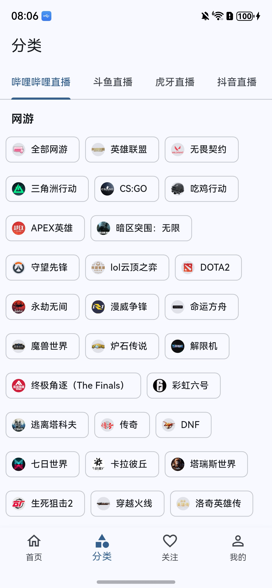

# Simple Live OHOS

[](https://github.com/yabi-zzh/simple-live-ohos/stargazers)
[](https://github.com/yabi-zzh/simple-live-ohos/releases)
[](https://github.com/yabi-zzh/simple-live-ohos/releases)
[](LICENSE)

简洁的多平台直播聚合应用，支持哔哩哔哩、斗鱼、虎牙、抖音直播，基于 [dart_simple_live](https://github.com/xiaoyaocz/dart_simple_live) 移植到 HarmonyOS NEXT。

> **免责声明**：本项目为个人学习移植项目，与原作者无关。所有功能和代码基于原项目进行适配，版权归原作者所有。本项目仅供学习交流使用，不得用于商业用途。使用本项目产生的任何问题由使用者自行承担，与原作者和移植者无关。

## 应用截图

<p>




</p>

## 下载安装

前往 [Releases](https://github.com/yabi-zzh/simple-live-ohos/releases) 下载最新版本的 HAP 安装包。

- 设备要求：HarmonyOS NEXT（API 12+）
- 设备架构：arm64-v8a

## 已实现功能

- ✅ 首页直播列表
- ✅ 分类浏览
- ✅ 搜索功能
- ✅ 直播间页面（视频播放 + 弹幕渲染）
- ✅ 收藏管理
- ✅ 历史记录
- ✅ 个人中心与设置（后台播放模式、硬件解码、自动全屏、缓冲区、定时关闭等）
- ✅ 弹幕设置（字号、透明度、速度、区域、描边、粗细、屏蔽词）
- ✅ 后台播控（锁屏 / 控制中心暂停恢复）
- ✅ 平板 / 2in1 设备适配（侧边导航、响应式网格、宽屏分栏直播间）

## 从源码构建

### 环境要求

- DevEco Studio 5.0 或更高版本
- HarmonyOS NEXT SDK（兼容 API 12+，目标 API 22）
- flutter_ohos 3.27.4
- Node.js (DevEco Studio 自带)

### 安装 flutter_ohos

本项目使用 OpenHarmony 适配的 Flutter 分支，而非官方 Flutter SDK。

```bash
# 克隆 flutter_ohos
git clone https://gitcode.com/openharmony-tpc/flutter_flutter.git flutter_ohos -b 3.27.4

# 配置环境变量，将 flutter_ohos/bin 加入 PATH
# Windows: 设置系统环境变量
# macOS/Linux: export PATH="$PATH:/path/to/flutter_ohos/bin"

# 验证安装
flutter doctor
```

详细说明参考 [OpenHarmony Flutter 适配指南](https://gitcode.com/openharmony-tpc/flutter_flutter)。

### 构建步骤

1. 克隆项目
```bash
git clone https://github.com/yabi-zzh/simple-live-ohos.git
cd simple-live-ohos
```

2. 安装依赖
```bash
flutter pub get
```

3. 构建运行

**方式一：DevEco Studio（推荐）**

使用 DevEco Studio 打开 `ohos` 目录，点击 Run 即可调试运行。

**方式二：命令行**
```bash
flutter run
```

> 注意：`flutter build hap --release` 命令行打包可能因 media_kit 原生模块的 cmake 构建问题而失败，建议使用 DevEco Studio 进行正式打包。

4. （可选）清理构建缓存，依赖变更或构建异常时执行：
```bash
flutter clean
flutter pub get
```

## 项目结构

```
simple-live-ohos/
├── lib/                    # Flutter 应用代码
├── ohos/                   # HarmonyOS 原生代码
├── media-kit/              # 视频播放库（本地依赖，含 libmpv.so）
├── simple_live_core/       # 直播平台 API 核心库
├── plugins/                # 本地插件
│   ├── canvas_danmaku/     # 弹幕渲染
│   ├── js_executor_ohos/   # JS 执行器（斗鱼/抖音签名）
│   └── wakelock_plus_ohos/ # 屏幕常亮
├── assets/                 # 静态资源
├── pubspec.yaml            # Flutter 依赖配置
└── LICENSE                 # GPL-3.0 开源协议
```

## 已知问题

- Vulkan 渲染偶现 `Failed to SetPresentInfo` 警告，不影响功能
- 部分直播平台 API 可能需要进一步适配
- 首次启动图片加载较慢

## HarmonyOS 适配说明

### 核心依赖适配

- **flutter_ohos**: 3.27.4 ([OpenHarmony Flutter 分支](https://gitcode.com/openharmony-tpc/flutter_flutter))
- **media_kit**: 使用 [Predidit/media-kit](https://github.com/Predidit/media-kit) 的 OpenHarmony 支持分支
- **libmpv.so**: 34MB 原生视频播放库 (arm64-v8a)，来自 [ErBWs/libmpv-ohos-build](https://github.com/ErBWs/libmpv-ohos-build)
- **canvas_danmaku**: 0.3.1 纯 Dart 弹幕渲染引擎
- **js_executor_ohos**: 基于 WebView 的 JS 执行器，用于斗鱼/抖音签名计算
- **simple_live_core**: 直播平台 API 核心库，来自原项目

### 主要修改

1. **路径依赖本地化**
   - media-kit：从 Git 依赖改为本地路径依赖，移除不支持的平台代码
   - wakelock_plus_ohos：从 pub.dev 缓存复制到本地 `plugins/`
   - canvas_danmaku：本地化并修复 API 兼容性问题
   - js_executor_ohos：本地 WebView JS 执行器插件，替代不支持 OHOS 的 JS 引擎

2. **存储服务适配**
   - 使用 Hive 本地存储，优先通过 hive_flutter 初始化
   - OHOS 平台回退到沙箱路径：`/data/storage/el2/base/haps/entry/files/hive`

3. **原生库加载**
   - 修改 `native_library.dart` 添加 OHOS 平台加载逻辑，优先加载 `libmedia_kit_libs_ohos.so` 包装库，回退到 `libmpv.so.2`
   - 更新 CMakeLists.txt 链接配置

4. **API 兼容性修复**
   - canvas_danmaku：`Color.toARGB32()` -> `Color.value`
   - 移除不支持的 Flutter 插件调用

## 致谢

- 原项目作者：[xiaoyaocz](https://github.com/xiaoyaocz)
  - [dart_simple_live](https://github.com/xiaoyaocz/dart_simple_live) - Flutter 多平台直播应用 & Dart 核心库
- flutter_ohos：[OpenHarmony Flutter 分支](https://gitcode.com/openharmony-tpc/flutter_flutter)
- media_kit OpenHarmony 支持：[Predidit/media-kit](https://github.com/Predidit/media-kit)
- libmpv HarmonyOS 构建：[ErBWs/libmpv-ohos-build](https://github.com/ErBWs/libmpv-ohos-build)

## 开源协议

本项目采用 [GPL-3.0](LICENSE) 协议开源，继承自原项目 [xiaoyaocz/dart_simple_live](https://github.com/xiaoyaocz/dart_simple_live)。

**第三方依赖许可证**：
- media_kit: MIT License
- canvas_danmaku: MIT License
- 其他依赖详见各自 LICENSE 文件

## 捐赠打赏

如果觉得本项目对你有帮助，欢迎打赏支持。

 

## Star History

[](https://star-history.com/#yabi-zzh/simple-live-ohos&Date)
